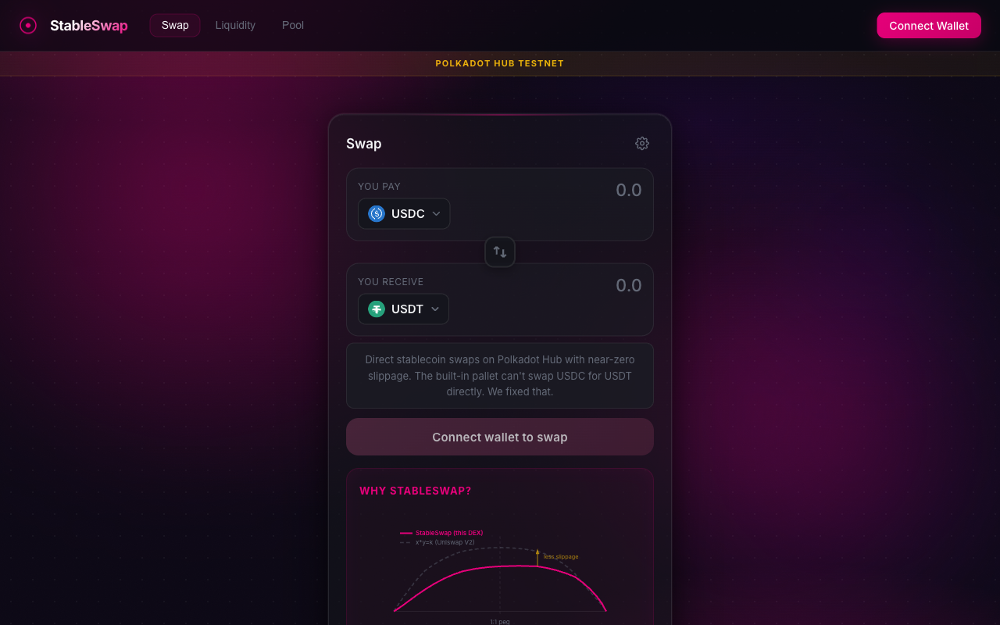
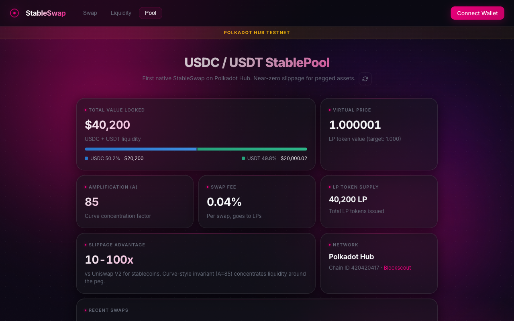
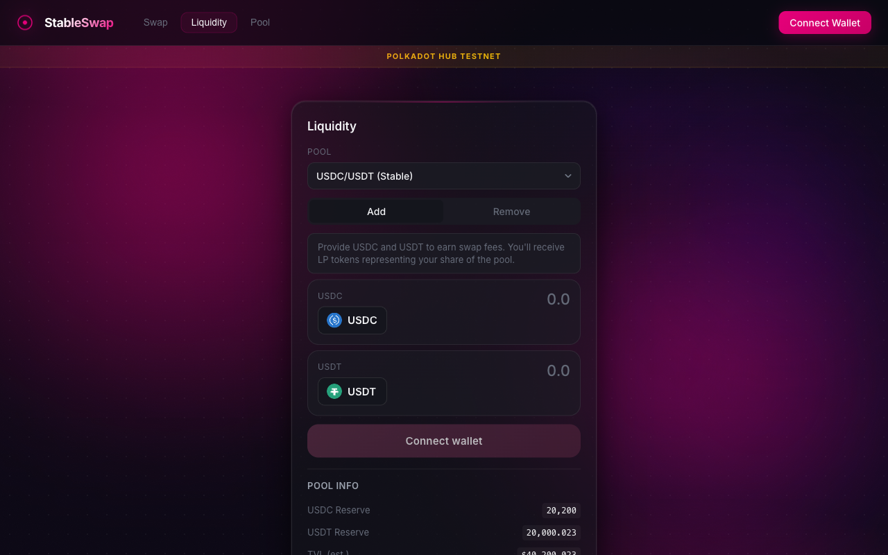

# StableSwap DEX on Polkadot Hub

A Curve-style StableSwap DEX deployed on Polkadot Hub, built for the Polkadot Solidity Hackathon 2026.

**[Live Demo](https://yonkoo11.github.io/polkadot-stableswap/)** | Connect MetaMask to Polkadot Hub TestNet to swap

## Screenshots

| Swap | Dashboard | Liquidity |
|------|-----------|-----------|
|  |  |  |

## Quick Walkthrough (For Judges)

1. Open the [live demo](https://yonkoo11.github.io/polkadot-stableswap/) and explore the **Pool** tab to see live on-chain stats (no wallet needed)
2. Add Polkadot Hub TestNet to MetaMask (Chain ID `420420417`, RPC `https://eth-rpc-testnet.polkadot.io/`)
3. Get test DOT from the [Polkadot Faucet](https://faucet.polkadot.io/) and click **Connect Wallet**
4. On the **Swap** tab, enter an amount and swap USDC for USDT in a single hop with near-zero slippage
5. On the **Liquidity** tab, add liquidity to earn swap fees and receive LP tokens

## Hackathon Tracks

- **Track 1: DeFi / Stablecoins** - Direct stablecoin swap infrastructure
- **Track 2: Native Asset Interaction** - ERC-20 precompile integration design (mock tokens on testnet, precompile-ready on mainnet)
- **OpenZeppelin Sponsor Track** - Non-trivial usage of 5 OpenZeppelin modules across pool contracts

## The Problem

Polkadot Hub's built-in AssetConversion pallet requires DOT in every trading pair. To swap USDC for USDT, you must route USDC -> DOT -> USDT, taking two hops with double slippage and double fees. There is no way to create a direct USDC/USDT pool using the pallet.

## The Solution

We deploy Solidity smart contracts on Polkadot Hub that:

1. **Direct stablecoin pools** - USDC/USDT swaps in a single hop with near-zero slippage
2. **StableSwap invariant** - Curve-style math optimized for pegged assets (10-100x better pricing than constant-product for stablecoins)
3. **Constant-product pools** - Standard x*y=k for volatile pairs (DOT/USDC, DOT/USDT)
4. **Multi-hop routing** - Router contract finds optimal paths across both pool types

**One-sentence pitch:** The pallet can't swap USDC for USDT directly. We fixed that.

## Architecture

```
src/
├── core/
│   ├── StablePool.sol          # Curve-style StableSwap pool (USDC/USDT)
│   ├── VolatilePool.sol        # Constant-product pool (DOT/USDC)
│   ├── PoolFactory.sol         # Pool registry and creation
│   └── Router.sol              # Multi-hop swap routing
├── libraries/
│   ├── StableSwapMath.sol      # Newton's method for StableSwap invariant
│   └── ConstantProductMath.sol # x*y=k math
├── tokens/
│   └── LPToken.sol             # ERC-20 LP tokens with access control
├── interfaces/
│   ├── IStablePool.sol
│   ├── IVolatilePool.sol
│   ├── IPoolFactory.sol
│   └── IRouter.sol
└── mocks/
    └── MockERC20.sol           # Test tokens (USDC, USDT)

frontend/
├── src/
│   ├── App.tsx                 # Root layout with tab navigation
│   ├── components/
│   │   ├── SwapPanel.tsx       # Token swap with real-time quotes
│   │   ├── LiquidityPanel.tsx  # Add/remove liquidity
│   │   ├── Dashboard.tsx       # Live pool stats (bento grid)
│   │   ├── Header.tsx          # Wallet connection + network detection
│   │   ├── SlippageChart.tsx   # StableSwap vs x*y=k comparison curve
│   │   └── TokenIcon.tsx       # USDC/USDT/DOT icons
│   ├── hooks/
│   │   ├── useWallet.ts        # MetaMask connection + chain switching
│   │   └── useContracts.ts     # Contract instances + read provider
│   └── config/
│       └── contracts.ts        # Addresses, ABIs, pool registry
└── index.html
```

## Frontend Features

- **Glass morphism UI** with aurora ambient background and frosted card surfaces
- **Real-time pool stats** fetched via `JsonRpcProvider` (no wallet required)
- **30-second auto-refresh** with manual refresh button on the dashboard
- **Mobile responsive** down to 390px (iPhone SE)
- **Swap panel** with live quote fetching, slippage settings, and StableSwap vs Uniswap V2 comparison chart
- **Liquidity panel** with add/remove tabs, pool info, and overlapping LP token icons
- **Dashboard** with bento grid layout showing TVL, composition bar, virtual price, amplification factor, swap fee, and recent swap history

### StableSwap Math

The StableSwap invariant for 2 tokens:

```
A*n^n * sum(x_i) + D = A*D*n^n + D^(n+1) / (n^n * prod(x_i))
```

Where `A` is the amplification coefficient (set to 85). Higher A = closer to constant-sum, meaning lower slippage for equally-pegged assets. We solve for `D` and output amounts using Newton's method with guaranteed convergence in <256 iterations.

For a 1,000 USDC swap in a pool with 10,000 USDC + 10,000 USDT:
- **StableSwap (A=85):** ~999.6 USDT (0.04% fee only)
- **Constant-product (x*y=k):** ~909 USDT (9.1% slippage + fee)

### OpenZeppelin Integration

Non-trivial usage across 5 contracts:

| Contract | OpenZeppelin Modules |
|----------|---------------------|
| StablePool | `ReentrancyGuard`, `Pausable`, `AccessControl`, `SafeERC20` |
| VolatilePool | `ReentrancyGuard`, `Pausable`, `AccessControl`, `SafeERC20` |
| LPToken | `ERC20`, `AccessControl` |
| PoolFactory | `Ownable` |
| MockERC20 | `ERC20` |

- `AccessControl` with `ADMIN_ROLE` and `MINTER_ROLE` for pool parameter tuning and LP minting
- `ReentrancyGuard` on all state-changing pool functions (swap, addLiquidity, removeLiquidity)
- `Pausable` as an emergency circuit breaker
- `SafeERC20` for safe token transfers

## Deployed Contracts (Polkadot Hub TestNet)

| Contract | Address | Verified |
|----------|---------|----------|
| USDC (Mock ERC-20) | [`0xf9e5a9E147856D9B26aB04202D79C2c3dA4a326B`](https://blockscout-testnet.polkadot.io/address/0xf9e5a9E147856D9B26aB04202D79C2c3dA4a326B) | Yes |
| USDT (Mock ERC-20) | [`0xb8F4546e24e437779bC09c3b70ce70Ff9542bdD4`](https://blockscout-testnet.polkadot.io/address/0xb8F4546e24e437779bC09c3b70ce70Ff9542bdD4) | Yes |
| PoolFactory | [`0x9A6d36A0487EA52df43E7704a97F47844C4Eac4E`](https://blockscout-testnet.polkadot.io/address/0x9A6d36A0487EA52df43E7704a97F47844C4Eac4E) | Yes |
| Router | [`0x6c70b98613Cc567e3c1FeE9248aE58d291e3AfFA`](https://blockscout-testnet.polkadot.io/address/0x6c70b98613Cc567e3c1FeE9248aE58d291e3AfFA) | Yes |
| StablePool (USDC/USDT) | [`0xDeA0792cEc959CE6893C24dEeFc6FE9B047a3Ea3`](https://blockscout-testnet.polkadot.io/address/0xDeA0792cEc959CE6893C24dEeFc6FE9B047a3Ea3) | Yes |

**Network:** Polkadot Hub TestNet (Chain ID: 420420417)
**RPC:** `https://eth-rpc-testnet.polkadot.io/`
**Block Explorer:** [Blockscout](https://blockscout-testnet.polkadot.io)

### Why Mock Tokens?

Polkadot Hub's ERC-20 precompile addresses for native USDC (asset ID 1337) and USDT (asset ID 1984) do not exist on the testnet yet. Both precompile addresses revert with memory allocation errors. We deploy standard ERC-20 mock tokens to demonstrate the protocol. On mainnet, the contracts would interact with native assets via the precompile interface without any code changes.

## Quick Start

### Prerequisites

- [Foundry](https://book.getfoundry.sh/getting-started/installation) (nightly recommended)
- [Node.js](https://nodejs.org/) v18+
- MetaMask or any EVM wallet

### Build & Test

```bash
# Clone
git clone https://github.com/Yonkoo11/polkadot-stableswap.git
cd polkadot-stableswap

# Install dependencies
forge install

# Build
forge build

# Run tests (48 tests across 4 test files)
forge test -vv
```

### Run Frontend

```bash
cd frontend
npm install
npm run dev
# Open http://localhost:5173
```

### Connect Wallet

1. Add Polkadot Hub TestNet to MetaMask:
   - Network Name: `Polkadot Hub TestNet`
   - RPC URL: `https://eth-rpc-testnet.polkadot.io/`
   - Chain ID: `420420417`
   - Currency Symbol: `DOT`
   - Block Explorer: `https://blockscout-testnet.polkadot.io`

2. Get test DOT from [Polkadot Faucet](https://faucet.polkadot.io/)

3. Import USDC and USDT tokens in MetaMask using the addresses above

### Deploy (Testnet)

```bash
# Set your private key
export PRIVATE_KEY=<your_key>

# Deploy everything (tokens, factory, router, pool, seed liquidity)
forge script script/DeployTestnet.s.sol:DeployTestnet \
  --rpc-url https://eth-rpc-testnet.polkadot.io/ \
  --private-key $PRIVATE_KEY \
  --broadcast --slow
```

## Testing

48 tests across 4 test suites:

| Suite | Tests | Coverage |
|-------|-------|----------|
| StableSwapMath | 10 | Math correctness, Newton's convergence, edge cases |
| StablePool | 20 | Swap, add/remove liquidity, fees, access control, pausing |
| VolatilePool | 10 | Swap, liquidity, flash loans, slippage protection |
| Integration | 8 | Factory, Router, multi-hop routing |

```bash
# Run all tests
forge test

# Run with verbosity
forge test -vvv

# Run specific suite
forge test --match-contract StablePoolTest
```

## Technical Details

- **Solidity 0.8.28** compiled with `via_ir = true`
- **Amplification coefficient:** A = 85 (tuned for stablecoin pairs)
- **Swap fee:** 0.04% (4 bps)
- **Admin fee:** 50% of swap fees reserved for protocol
- **Decimals:** Both USDC and USDT use 6 decimals, normalized to 18 internally for StableSwap math precision
- **LP tokens:** ERC-20 with role-based minting (only the pool contract can mint/burn)

## License

MIT
